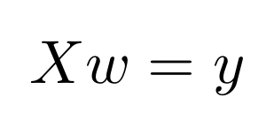
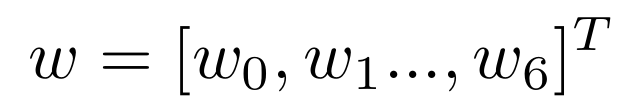
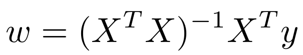

<center>
<h1>
In The Name Of ALLAH
</h1>
<h2>
Advanced Programming - Homework 2
</h2>
<h2>
Dr.Amir Jahanshahi
</h2>
<h3>
Deadline: Wednesday, 28 Esfand - 23:00
</center>

# Introduction
In this homework you're going to estimate an AP student's grade again! but in a different method using Linear Algebra! As you might have guessed, you will be doing this by using some matrices and functions defined on them like determinant, inverse, transpose , etc. There are some **Question**s in this serie. Remember to write their answer in your report file. You must not alter any of the given prototypes, but you're free to add whatever you want to both **Matrix.cpp, Matrix.h** and **aphw2.cpp, aphw2.h** files. By the way, you must write **ALL** of your codes in those 4 files! You *must* not alter the **main.cpp** again!


# Matrix Class
Implement a **Matrix** class that represents a mathematical matrix. It must have a *private* **data** variable which is the data of the matrix. Besides, you must have the size of the matrix too. So your class will also have a *private* **size** variable which is a 2-element array of *size_t*. You must implement it with a ```std::array<size_t,2>``` data type. The first element of size will be number of rows and the second one will be number of columns. As it might have passed your mind, so far, user doesn't have any access to size since it is private, so you must implement **getSize()** function for the user in the *public* part.

# Matrix Properties
**Matrix** class must have the following constructors.

*   ```Matrix(const Matrix& mat);```
*   ```Matrix(std::vector<std::vector<double>> data)```;
*   ```Matrix (std::unique_ptr<std::unique_ptr<double[]>[]> data, size_t m, size_t n);``` where m and n are the number of rows and columns.

  **Question1**: Is the above constructor a correct one? If no explain why? What would you do to repair it? Do it!
*   ```Matrix (size_t m, size_t n, bool ones=true);``` where m and n are number of rows and columns. if **ones** flag is *true*, each element of the matrix must be 1. Otherwise, it must be 0.

**Matrix** class must have the following member variables.

*   **data**: Elements of your matrix. This variable must be private.
*   **size**: Number of rows and columns of your matrix, packed in a 2-element array. This variable must be private.

It must also have the following member functions.

*   **getSize**: This function returns a 2-element array representing size of the matrix.

  ```c++
  std::array<size_t, 2> getSize();
  ```

*   **det**: This function must return a double representing determinant of the matrix. If the matrix is not in the square form, it must return 0 and print a proper message.

  ```c++
  double det(); 
  ```
*   **inv**: This function must return a matrix object representing inverse of the matrix. In the case the matrix not being square, you must print a proper message and return a matrix of all 0s with the same dimensions as the matrix.

  ```c++
   Matrix inv();
   ```
*   **T**: This function must return a matrix object representing the transpose of the matrix.
  
  ```c++
  Matrix T();
  ```
*   **show**: This function displays the matrix in a beautiful way.

*   **delCol**: This function removes the given (i-th) column of the matrix. In addition, it must return the remaining matrix too.

  ```c++
  Matrix delCol(size_t i);
  ```

*   **col**: This function returns the given (i-th) column of the matrix as a new matrix.

  ```c++
  Matrix col(size_t i);
  ```

*   **save**: This function saves the matrix as a csv file with the given file name as its argument.

  ```c++
  void save(const char*);  
  ```

*   **load**: This function loads a csv file into a matrix.

  ```c++
  void load(const char*);
  ```

In addition, you're supposed to implement the Matrix class such that the following sample codes work properly. variables *a* and *b* are Matrix objects.

```c++
Matrix c {a + b};
Matrix d {a.inv()*b};
d[0][1] = 5;
Matrix e {inv(a-b)};
Matrix f {a * b.T()};
f.show();
```


# Other Functions
In the **aphw2.cpp** you must implement the following functions.

*   **det**: This function gets a matrix and must return an *optional* double representing determinant of the given matrix. If the matrix is not in the square form, it must return 0 and print a proper message.

  ```c++
  std::optional<double> det(Matrix&); 
  ```

  **Question2:** If we define the arugment as ```const Matrix&``` how should we change the Matrix class?
*   **inv**: This function gets a matrix and must return an *optional* matrix object representing inverse of the given matrix. In the case the matrix not being square, you must print a proper message and make use of the *optional* to return nothing!

  ```c++
   std::optional<Matrix> inv(Matrix&);
   ```
*   **transpose**: This function must return an *optional* matrix object representing the transpose of the matrix.
  
  ```c++
  std::optional<Matrix> transpose(Matrix&);
  ```

*   **getData**: This function is very similar to the last homework. However, there are some differences! first of all, you have a second argument **add_bias** which is a *bool* and by default is **true**. In case it is **true**, it must add a column of **1**s just like last homework as the first column of data. When it is **false**, your function must not add those **1**s and it must simply import the data in the file. Note that you must not normalize your data in this function. 
```c++
std::vector<std::vector<double>> getData(const char* filename, bool add_bias=true);
```

*   **findMinNoOfMultiplications**: This function must find the minimum number of required scalar multiplications in the so-called *Matrix Chain Multiplication* problem discussed in the TA class. You must use **Dynamic Programming** approach to do this.
```c++
size_t findMinNoOfMultiplications(std::vector<Matrix>& v);
```

# Estimation Problem
If you're here, congratulations! Now you have lots of abilities and power because you can do stuff with matrices! With your **getData** function, form the matrix **X** of previous students features. Each row of **X** is a **1** (just like last homework) and the 6 parameters of each student. After that, form the matrix **y**. **y** is actually a vector(column matrix) in which each row is the grade of a student.

As we'll explain in the last part of TA class for linear algebra lovers, the estimation problem would turn into the following matrix equation.





For solving this equation we have



So from the last formula, you can and must find the best weights (w) for estimating grades.

Implement **findWeights** function which gets the name or path of the csv data file and returns the proper weights founded from the above formula as a Matrix object. Note that your function must work well with arbitrary csv files with the following assumption that the last column is the target (desired output) and the other columns are the inputs (features).

```c++
  Matrix findWeights(const char*);
```

If you've reached here, congratulations, you can buy yourself a chocolate! Just one more thing...Implement **predict** function that gets the data file name with the weights matrix and a bool **disp** argument. It returns the estimated outputs as a Matrix and also if *disp* is true it must display each prediction with its corresponding target value in a beauty manner (Just like *displayOutput* function in the last homework.

```c++
Matrix predict(const char*, Matrix& w, bool disp=false);
```

